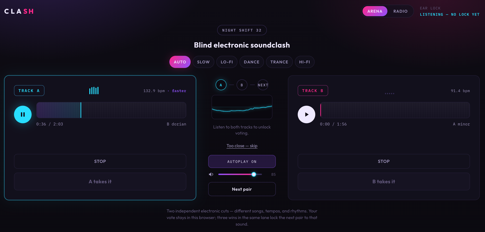

# CLASH

A local electronic **soundclash** and **radio station**. The backend procedurally synthesizes electronic cuts — trance, dance, lo-fi, hi-fi, slow — so you can either duel two tracks in Arena or keep one station on air in Radio.

Nothing is persisted on the server. Arena preferences (vote history and a 3-in-a-row style lock) live in browser `localStorage`.



## Modes

| Mode | What it is | Quality |
|------|------------|---------|
| **Arena** | Blind A/B soundclash: two independent cuts, vote for the one that hits | Higher (~120s, 32 kHz) |
| **Radio** | Continuous stream on **one** locked style (no Auto) | Medium–low (~55s, 22 kHz) so the backend can warm a queue without burning CPU/RAM |

Switch modes from the top nav once the app is running.

## Run it

### Docker Compose (full local stack)

```bash
docker compose up --build
```

- **UI:** [http://localhost:8080](http://localhost:8080)  
- **API:** [http://localhost:8000](http://localhost:8000) (`/api/health`)

Stop with `Ctrl+C` or `docker compose down`.

### Dev servers (hot reload)

```bash
# install (once)
npm install
npm --prefix frontend install
python3 -m pip install -r backend/requirements.txt

# both servers
npm run dev
```

Open [http://localhost:5173](http://localhost:5173).

API: `http://127.0.0.1:8000` · Web proxies `/api` → the API.

### Separate terminals

```bash
# terminal 1 — API
cd backend
python3 -m uvicorn app.main:app --reload --host 127.0.0.1 --port 8000

# terminal 2 — UI
cd frontend
npm run dev
```

## How Arena works

1. Pick a pace: **Slow**, **Lo-fi**, **Dance**, **Trance**, **Hi-fi**, or **Auto**.
2. The desk presses two **independent** tracks (~120s) — different composition, tempo, and rhythm.
3. Play / pause / stop / seek each stack; volume and autoplay live in the center column.
4. Vote after hearing both. Choosing a winner **keeps that cut playing** (it is not skipped).
5. Three wins in the same lane lock the next press toward that lane (local only).
6. About **30s after** a pair starts, the next pair is pre-generated for a faster handoff.

## How Radio works

1. Switch to **Radio** in the nav.
2. Pick a station (**Trance**, **Dance**, **Lo-fi**, **Hi-fi**, or **Slow** — **no Auto**).
3. **Go on air** — the API serves cheaper continuous cuts and keeps a small warm queue in the background (`RADIO_WARM_DEPTH`, default 4).
4. The client buffers **3–4 tracks ahead** so skips and track ends stay smooth.
5. Skip anytime; change station to drop the old queue and warm the new lane.

Radio uses a separate **quality profile** (22.05 kHz, ~55s, thinner parts/FX) so generating many cuts costs roughly a third of an arena track. Generation is intentionally serial (`RADIO_WORKERS=1`) so Arena is not starved.

## Sound design notes

Engines follow electronic patterns — 4-on-the-floor, broken kick, half-time, shuffle, rolling bass, gated supersaw, house stabs, dusty lo-fi keys — randomized so no two cuts match. Dense snare-roll “machine gun” fills and repetitive metallic perc bursts are intentionally disabled or heavily limited.

## Deploy (GitHub → Vercel + separate API)

The **UI** goes on **Vercel**. The **API** (track synthesis) needs a long-running host (Fly / Railway / Render) — not Vercel serverless.

See **[DEPLOY.md](./DEPLOY.md)** for the full checklist (`VITE_API_URL`, `CORS_ORIGINS`, Docker).

## How the engine works

See **[docs/how-to.md](./docs/how-to.md)** for a full walkthrough of compose → render → WAV, including Mermaid diagrams.

## Repo map

| Path | Role |
|------|------|
| [`AGENTS.md`](./AGENTS.md) | Orientation for coding agents |
| [`DEPLOY.md`](./DEPLOY.md) | Vercel + remote API hosting |
| [`docs/how-to.md`](./docs/how-to.md) | Music engine explained (+ diagrams) |
| [`docs/`](./docs/) | Assets + executed product plans |
| [`docs/plans/radio-mode.md`](./docs/plans/radio-mode.md) | Radio mode plan (implemented) |
| [`backend/`](./backend/) | FastAPI + procedural synthesis |
| [`frontend/`](./frontend/) | React Arena + Radio UI |
| [`docker-compose.yml`](./docker-compose.yml) | Local full stack |

## Stack

- Backend: Python, FastAPI, NumPy, SciPy  
- Frontend: React 19, TypeScript, Vite 6  
