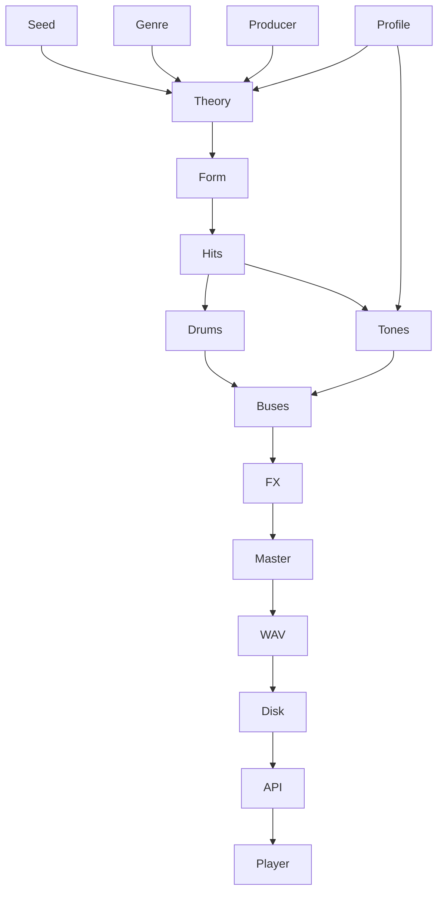
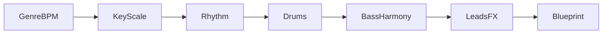
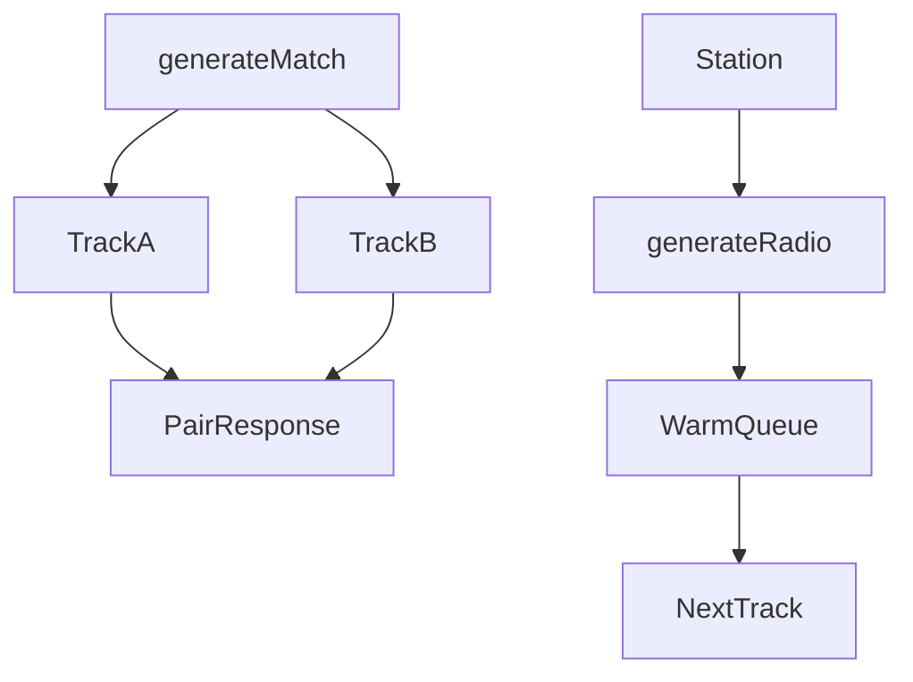

# How CLASH makes music

A reference for how the **procedural engine** works — useful when revisiting the repo later.

There is **no sample library** and **no external AI music API**. Music is invented from random seeds and style rules, then synthesized to stereo **WAV** with NumPy/SciPy.

## Two product paths, one engine

| | **Arena** | **Radio** |
|--|-----------|-----------|
| Job | Two competing cuts (A vs B) | Continuous stream of one style |
| Length | ~120s | ~55s |
| Sample rate | 32 kHz | 22.05 kHz |
| Complexity | Fuller mix | Fewer voices / thinner parts / lighter FX |

Profiles live in `backend/app/engine/quality.py` (`ARENA`, `RADIO`).

## Pipeline overview

*(Node **ids** avoid Mermaid reserved words like `style`. Meaning: Seed / Genre / Producer / Profile → Theory → Form → Hits → Drums & Tones → Buses → FX → Master → WAV → Disk → API → Player.)*

## Stage 1 — Compose (`compose.py` + `theory.py`)

Builds a **score** (when / what / pitch / velocity), not audio yet.

- **Key, scale, chord progression** from style tables (e.g. minor + classic trance degrees).
- **BPM** from style ranges (trance ~132–140, dance ~122–128, lo-fi ~80–94, …).
- **Bar count** from target length so duration stays near ~55s or ~120s.
- **Form** scales with length: intro → build → breakdown → drop.
- **Rhythm engine**: straight, broken, shuffle, half-time, minimal (dense metallic ticks avoided).
- Emits **hits**: `kick`, `clap`, `hat`, `bass`, `pad`, `lead`, `arp`, `crash`, `riser`, …

**Producers** (`apex`, `nimbus`, `warehouse`, `tape`, `voltage`, `halo`) are mix personalities (brightness, drive, delay/reverb amount) — not ML models.

## Stage 2 — Render (`render.py` + `drums.py` + `dsp.py`)

Turns each hit into waveforms:

| Layer | How it’s made |
|-------|----------------|
| Drums | Synthesized one-shots (sine-sweep kick, noise snare/clap, filtered hats); cached per style |
| Bass / lead / pad | Sines, saws, small supersaw stacks + low-pass |
| Arps / stabs / keys | Short filtered tones or simple FM |
| Mix | Buses: drums / bass / music / FX |
| Glue | Sidechain under kicks; light delay + reverb + widen; normalize + soft clip |

Sample rate comes from the **quality profile** via a thread-local SR (`use_sample_rate`), so arena and radio can run without stomping each other.

## Stage 3 — Encode and serve

1. PCM → 16-bit stereo WAV.
2. Written under a **disk cache** (`CLASH_CACHE_DIR` / temp).
3. Session keeps track IDs + paths (not multi‑MB blobs in RAM forever).
4. Frontend plays via `GET /api/audio/{id}`.

## Arena vs Radio generation

- **Arena:** two independent cuts (different tempo/rhythm/producer); optional parallel process pool; client may prefetch the next pair after ~30s.
- **Radio:** one station locked (never Auto); cheap `RADIO` profile; server keeps a small warm queue (`RADIO_WARM_DEPTH`, serial `RADIO_WORKERS`) so the UI can buffer 3–4 cuts ahead.

## What makes it “random but on-style”

Every cut gets a **seed**. That seed drives progression choice, motif contour, swing, rhythm map, and producer — so tracks differ while still following **genre rules** (e.g. trance: 4-on-floor, rolling bass, drop after breakdown).

## What it is not

- Not Suno / Udio / MusicGen  
- Not MIDI + soundfonts (the hit list is only MIDI-*like*)  
- Not a DAW project — pure code synthesis for speed and zero sample assets  

## Mental model

A **tiny generative DAW in Python**:

1. **Arrange** a sparse electronic arrangement from templates.  
2. **Synthesize** each note/drum with math.  
3. **Bounce** to WAV and hand it to the web player.

## Code map

| File | Role |
|------|------|
| `backend/app/engine/quality.py` | Arena vs Radio presets |
| `backend/app/engine/generate.py` | `generate_match`, `generate_track`, `generate_radio_track` |
| `backend/app/engine/compose.py` | Blueprint / hits / form |
| `backend/app/engine/theory.py` | Scales, progressions, producers, paces |
| `backend/app/engine/render.py` | Instruments + mix + FX |
| `backend/app/engine/drums.py` | Drum one-shots |
| `backend/app/engine/dsp.py` | Sample rate, filters, delay, reverb |
| `backend/app/radio_queue.py` | Station warm queue for Radio |
| `backend/app/store.py` | Session + on-disk WAV paths |
| `backend/app/main.py` | HTTP API |

## Related docs

- [plans/radio-mode.md](./plans/radio-mode.md) — product plan for Radio (implemented)
- [../AGENTS.md](../AGENTS.md) — full agent orientation
- [../README.md](../README.md) — run / deploy overview
